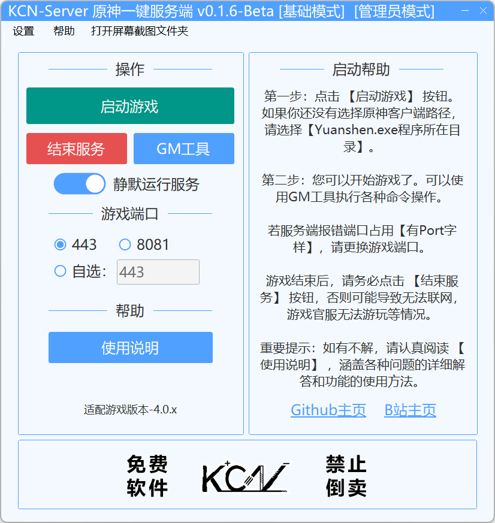

转载于CSDN博主「计泽财」  原文链接：https://blog.csdn.net/gitblog_01075/article/details/156500165
版权声明：本文为CSDN博主「计泽财」的原创文章，遵循CC 4.0 BY-SA版权协议，转载请附上原文出处链接及本声明。


## 准备工作
https://gitcode.com/gh_mirrors/kc/KCN-GenshinServer/?utm_source=gitcode_aigc_v1_t0&index=top&type=card&&uuid_tt_dd=10_20282753200-1780508246843-282083&from_id=156500165&from_link=2cc9c260bbdf9c4b5804a531465d9f6e

搭建原神私服前，首先需要准备好基础环境：
系统要求：
操作系统：Windows 10/11（推荐）
内存：8GB及以上
存储空间：至少10GB可用空间
项目获取： 打开命令行工具，执行以下命令克隆项目：
```mdx
<Steps>
git clone https://gitcode.com/gh_mirrors/kc/KCN-GenshinServer
</Steps>
```
必要组件：
Java运行环境（项目自动检测）
原神游戏客户端（4.0.x版本）


## 实战操作：从零开始搭建服务器
基础模式：新手友好型启动
对于初次接触的玩家，建议从基础模式开始。这个模式将复杂的功能封装在简洁的界面中，只需三步即可启动服务器：
1.启动主程序：双击运行KCN-GenshinServer.exe
2.选择游戏路径：在界面中指定原神客户端位置
3.一键启动：点击"启动服务"按钮


专业模式：进阶配置选项
当你熟悉基础操作后，可以切换到专业模式，解锁更多高级功能：
代理模式选择：经典代理、内部代理、外部代理
SSL加密配置：增强连接安全性
端口自定义：避免与其他服务冲突

核心功能深度解析
代理系统：网络连接的关键
KCN-GenshinServer内置了三种代理模式，满足不同网络环境需求
经典代理：适合大多数家庭网络环境 内部代理：提供更稳定的连接体验 外部代理：支持复杂的网络架构

数据管理：安全无忧的游戏体验
担心游戏数据丢失？项目内置了完善的数据保护机制：

自动备份：定期保存服务器状态
快速恢复：一键还原至备份点
玩家管理：权限分级与账号管理
常见问题与解决方案


## 启动失败排查指南
问题1：端口被占用

解决方案：在专业模式中修改端口号，或关闭占用端口的程序
问题2：客户端路径错误

解决方案：重新选择原神游戏安装目录
连接问题处理
问题：无法连接服务器

检查防火墙设置
确认代理模式选择正确
验证IP地址配置


## 安全使用须知
重要提醒：

本项目仅供学习和技术交流使用
搭建私服前请了解相关法律法规
尊重游戏开发商的知识产权